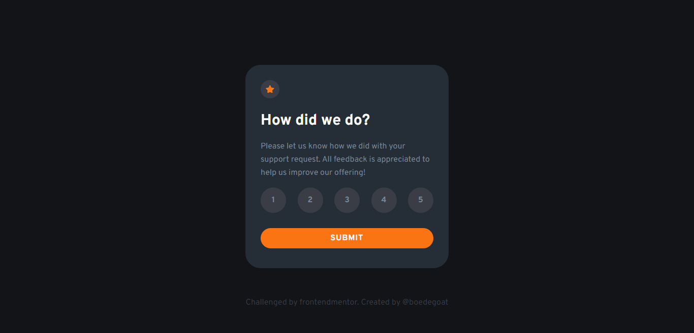

# Interactive Rating Component

<!-- screenshots here -->

A challenge from [frontendmentor.io](https://www.frontendmentor.io/)

## Overview

### Links

- [Live Site](https://fm-interactive-rating-component.vercel.app/)
- [Solution](https://www.frontendmentor.io/solutions/css-flexbox-HyqAOqtfc)

### The challenge

Users should be able to:

- View the optimal layout for the site depending on their device's screen size
- See hover states for all interactive elements on the page
- Create the background shape using code

## My process

### Built with

- Semantic HTML5 markup
- CSS custom properties
- Flexbox

## Acknowledgments

Thank you very much to everyone who gave me feedback on my solution. It greatly assists me in improving my frontend development skills.
